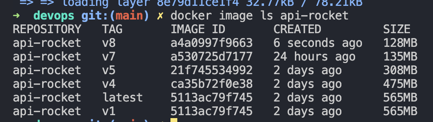

# Description

This is a next.js app that is used to showcase docker and devops workflows.


# Running the next.js app

```bash
yarn run start
````

# Docker - containers

## Build the image (Colima) with legacy docker command

```bash
docker --context colima build -t api-rocket .
```

## Build the image (Colima) with buildx

Steps to Integrate Buildx
1. Ensure Buildx is Available to Docker

The docker-buildx command indicates the standalone executable is installed, but Docker doesn't recognize it as a CLI plugin. To resolve this:

Move the docker-buildx binary to the Docker CLI plugins directory:

mkdir -p ~/.docker/cli-plugins
ln -s $(which docker-buildx) ~/.docker/cli-plugins/docker-buildx

This command creates a symlink so Docker recognizes Buildx as a plugin.
2. Verify Buildx Integration

Run:

docker buildx version

You should now see version information for Buildx, indicating it's properly integrated.
3. Create a Buildx Builder

If this is the first time you're using Buildx, create a builder:

docker buildx create --use

To verify:

docker buildx ls

You should see a list of builders, with one marked as default.
4. Test Buildx

Now you can try your Buildx command again:

docker buildx build --tag api-rocket --load .

```bash
docker buildx build --platform linux/amd64,linux/arm64 -t api-rocket --push .
```
or
```bash
docker buildx build --tag api-rocket --load .
```

## Running the container

```bash
docker run -p 3000:3000 -d api-rocket
```

-d - run the container in detached mode (in the background)
-p 3000:3000 - map port 3000 from the container to port 3000 on the host
api-rocket - the name of the image to run

# Useful Docker commands

## Logs

```bash
docker logs <container-id>
```

## Run a command inside the container

```bash
docker exec -it <container-id> <command>
```

## Stop a container

```bash
docker stop <container-id>
```

## History

```bash
docker history <image-id>
```

## Network

### List

```bash
docker network ls
```

### Create

```bash
docker network create <network-name>
```

### Inspect

```bash
docker network inspect <network-name>
```

## Docker Exec

```bash
docker exec -it <container-id> /bin/bash
```

# General information about containers

## Volumes

### List

```bash
docker volume ls
```

A volume is a persistent data storage area that the container can use to store data. When a container is deleted, the data in the volume is not deleted.

## Creating a volume

```bash
docker volume create <volume-name>
```

## Inspecting a volume

```bash
docker volume inspect <volume-name>
```

## Running a container with a volume

```bash
docker run -v <volume-name>:<container-path> <image-name>
```

#### Example

```bash
docker run -v primeiro-volume:/usr/src/app -p 3000:3000 -d api-rocket:v3
```

Volume has to be pointed to the same path as the container path in the dockerfile.

#### Network

Network can be passed as a parameter to the docker run command.

```bash
docker run -p 3000:3000 -d --network <network-name> api-rocket
```

#### Example 

```bash
docker run -p 3000:3000 -d --network primeiro-network api-rocket:v3
```

## More optimizations about containers

### Multi-stage builds

Multi-stage builds are a feature of Docker that allow you to use multiple build stages in a single Dockerfile. This can be useful for reducing the size of your Docker images and improving build times.

# Alpine and Strech

Alpine is a lightweight Linux distribution that is commonly used in Docker containers due to its small size and security features. However, Alpine uses a different C library (musl) than most other Linux distributions, which use glibc. This can cause compatibility issues when running applications that are compiled for glibc on Alpine.

Strech is a Debian-based Linux distribution that is commonly used in Docker containers. It uses the glibc C library, which is the same as most other Linux distributions, making it more compatible with applications that are compiled for glibc.

# Successive versions and their improvement in sizes overtime



# Database

## MySQL

### Getting the container ready by command line

```bash
docker run -d -p 3306:3306 -e MYSQL_ROOT_PASSWORD=root -e MYSQL_DATABASE=rocketseat-db -e MYSQL_USER=admin -e MYSQL_PASSWORD=root --name mysql mysql:8
```

### Troubleshooting issues

In case an error ocurrs when connecting from the app, check user and privilegies.

```bash
DROP USER IF EXISTS 'admin'@'%';
CREATE USER 'admin'@'%' IDENTIFIED WITH mysql_native_password BY 'root';
GRANT ALL PRIVILEGES ON *.* TO 'admin'@'%';
FLUSH PRIVILEGES;
```

# Some useful packages 

## Brew

1. watch

```bash
brew install watch
```

Usage: 

```bash
watch docker ps
```